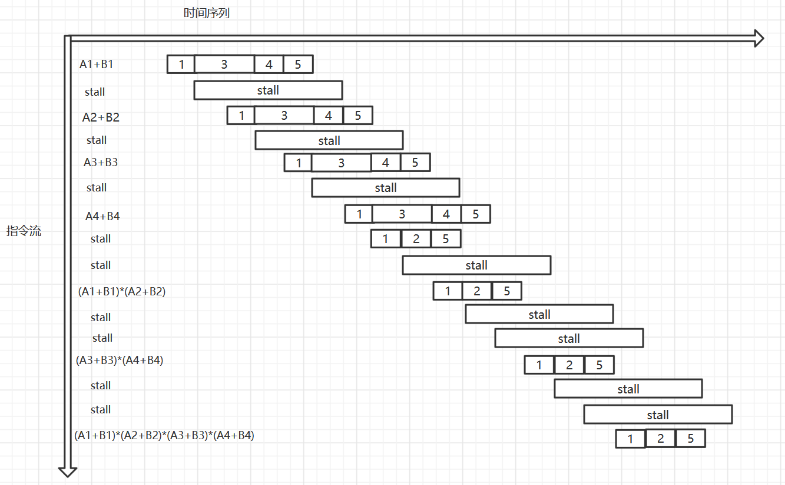

# 计算机体系结构 HW2

PB18111697 王章瀚

-----

## EX1

```riscv
    sw      x0, 7000(x0)        ; i = 0
    add     x6, x0, 100         ; x6 = 101
    lw      x7, i5000           ; lw 5000 from `i5000`
    lw      x7, 0(x7)           ; x7 = C = mem[5000]
loop:
    lw      x5, i57000           ; lw 7000 from `i7000`
    lw      x5, 0(x5)           ; x5 = i = mem[7000]
    add     x29, x0, 2          ; x29 = 2
    sll     x28, x5, x29        ; x28 = i << 2
    lw      x29, i3000
    lw      x29, 0(x29)         ; x29 = B[i]
    add     x29, x29, x7        ; x29 = B[i] + C
    sw      x29, 1000(x28)      ; A[i] = B[i] + C
    ; loop body end
    add     x5, x5, 1           ; i++
    lw      x30, i7000          ;
    sw      x5, 0(x30)          ; mem[7000] = i
    blt     x5, x6, loop        ; if i < 101, loop
    
    ; done

i3000:
    3000
i5000:
    5000
i7000:
    7000

```

按此代码, 整个 `loop` 标签标记的循环体共执行 $12 \times 101 = 1212$ 条, 加上最开始的初始化 4 条, 总共是 1216 条

**纯代码和数据**大小为 20 条指令 + 3 个字的大小, 即 $32 bits \times 23=736 bit$,

若**算上数组 A, B 和 C, i 的存储空间**, 则至少需要再 $101*2*32bits + 2 * 32bits=6528 bits$, 加上代码是 $6528+736=7264$

## EX2

32 个通用寄存器意味着只需要 5 bits 的地址空间即可.

### 1
对于两地址指令, 则只剩下 2 bits 的空间对指令编码, 可以取最高位 00 - 10
对于单地址指令, 最高位只能是 11, 但还剩下 5 bits 的空间可以编码, 故令最高位为 1100000 - 1111101 作为单地址指令的操作码
对于零地址指令, 最高位则只能是 1111110 或 1111111 了, 此时还剩下 $2 \times 2^5=64$ 个码点, 可以安排下 45 个零地址指令.

因此**可能**.

### 2
同理分析:
对于两地址指令, 则只剩下 2 bits 的空间对指令编码, 可以取最高位 00 - 10
对于单地址指令, 最高位只能是 11, 但还剩下 5 bits 的空间可以编码, 故令最高位为 1100000 - 1111110 作为单地址指令的操作码
对于零地址指令, 最高位则只能是 1111111 了, 此时只剩下 $2^5=32$ 个码点, 无法排下 35 个零地址指令

因此 **不可能**

### 3

因为已经编码了 3 个两地址指令, 考虑剩余的 110...0 - 111...1 的空间, 为了能编码 24 个零地址指令, 因为 $2^4 < 24 < 2^5$, 故只需要提供一个高 7 位确定了的空间给它们编码即可(例如111111100000 - 111111111111). 而剩余还有 $2^5 - 1=31$ 个码点(1100000...-1111110...)可以给单地址指令编码

因此最多可以为这一处理器编码 31 个单地址指令

## EX3

2 位 16 进制数能填满一个字节

### 1
对于大端序, 数据的低位存放在高地址空间. 

|地址|值|ASCII|
|:-|:-|:-|
|低地址|43|C|
||4F|O|
||4D|M|
||50|P|
||55|U|
||54|T|
||45|E|
|高地址|52|R|

故存储的字符串若从低地址往高看, 则是 "COMPUTER", 反之则反

### 2
同理, 只需要反过来即可
对于小端序, 数据的低位存放在低地址空间. 

|地址|值|ASCII|
|:-|:-|:-|
|低地址|52|R|
||45|E|
||54|T|
||55|U|
||50|P|
||4D|M|
||4F|O|
|高地址|43|C|

故存储的字符串若从低地址往高看, 则是 "RETUPMOC", 反之则反

### 3
非对齐的应是 4F4D, 4D50, 4D50, 5055, 5554, 5445. 4552 (均为十六进制表示)

### 4
非对齐可读出的 4 字节十六进制数有 50555445, 4D505554, 4F4D5055, 434F4D50

## EX4
### 1
时钟周期应为最长流水段耗时加上寄存器延迟, 即 2ns + 0.1ns = 2.1ns
### 2
长远看(不考虑很小程序), $CPI=\frac{4+1}{4}=1.25$
### 3
长远看(不考虑很小程序), 加速比为 $\frac{T_{单}}{T_{流}}=\frac{7}{2.1}\approx3.333$

若考虑第 2 题所述每 4 条指令一次停顿, 则加速比为 $$\frac{T_{单}}{T_{流}}=\frac{7}{1.25\times2.1}\approx2.667$$

## EX5
### 1
仅考虑数据相关, 则
5 级流水线平均指令时间 $T_1=\frac{5+1}{5}\times 1ns=1.2ns$,
12 级流水线平均指令时间 $T_2=\frac{8+3}{8}\times 0.6ns=0.825ns$
故 12 级流水线相对于 5 级流水线加速比为 $\frac{1.2}{0.825}\approx 1.45$

### 2
对于 5 级流水机器, $CPI_1=(20\%\times5\%\times(1+2)+20\%\times95\%\times1+80\%\times 1)\times\frac{6}{5}=1.224$
对于 12 级流水, $CPI_2=(20\%\times5\%\times(1+5)+20\%\times95\%\times1+80\%\times 1)\times\frac{11}{8}=1.44375$

## EX6
### 时空图
其时空图如下:


### 吞吐率
吞吐率 $TP=\frac{7}{17\Delta t}$

### 加速比
原本做一次加法需要 $4\Delta t$, 一次乘法需要 $3\Delta t$, 总共 4 次加法, 3 次乘法, 故有
$$T_{原}=4\times 5\Delta t + 3\times 3\Delta t=29 \Delta t$$
流水化后, 只需 $17\Delta t$, 故加速比是 $S=\frac{29\Delta t}{17\Delta t}\approx1.7059$

### 效率

$E=\frac{29}{17* 5}\approx 0.3412$
