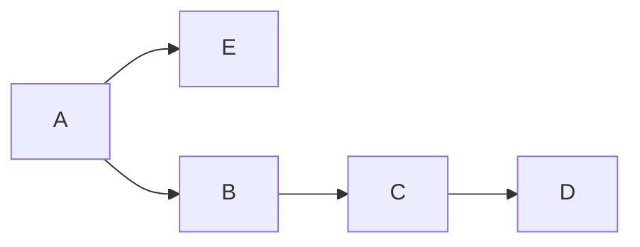

# HW3

PB18111697 王章瀚

-----

## 1.
**已知有关系模式 $R(A,B,C,D,E)$, $R$ 上的一个函数依赖集如下:**
$$F=\{A\rightarrow BC, B\rightarrow CE, A\rightarrow B, AB \rightarrow C, AC\rightarrow DE, E\rightarrow A\}$$

### (1).
**求出 $F$ 的最小函数依赖集 (要求写出求解过程)**

**将右边写出单属性并去除重复 FD**:
$F=\{A\rightarrow B, A\rightarrow C, B\rightarrow C, B \rightarrow E, AB\rightarrow C, AC\rightarrow D, AC \rightarrow E, E\rightarrow A\}$

**消除左部冗余属性**:

由 $A\rightarrow B$ 和 $B\rightarrow C$ 可推出 $A\rightarrow C$, 因此 $AB\rightarrow C$ 中的 $B$ 可以去掉, 去掉后变成了 $A\rightarrow C$:
$F=\{A\rightarrow B, A\rightarrow C, B\rightarrow C, B \rightarrow E, AC\rightarrow D, AC \rightarrow E, E\rightarrow A\}$

由 $A\rightarrow C$ 和 $A\rightarrow A$ 可知 $A\rightarrow AC$, 进而 $A\rightarrow D$, 因此 $AC \rightarrow D$ 左部的 $C$ 可去掉: 
$F=\{A\rightarrow B, A\rightarrow C, B\rightarrow C, B \rightarrow E, A\rightarrow D, AC \rightarrow E, E\rightarrow A\}$

同理, $AC\rightarrow E$ 左部的 C 也可以去掉: 
$F=\{A\rightarrow B, A\rightarrow C, B\rightarrow C, B \rightarrow E, A\rightarrow D, A \rightarrow E, E\rightarrow A\}$

**消除冗余函数依赖**

由 $A\rightarrow B$ 和 $B\rightarrow C$ 可推出 $A\rightarrow C$, 因此 $A\rightarrow C$ 可去掉: 
$F=\{A\rightarrow B, B\rightarrow C, B \rightarrow E, A\rightarrow D, A \rightarrow E, E\rightarrow A\}$

由 $A\rightarrow B$ 和 $B\rightarrow E$ 可推出 $A\rightarrow E$, 因此 $A\rightarrow E$ 可去掉: 
$F=\{A\rightarrow B, B\rightarrow C, B \rightarrow E, A\rightarrow D, E\rightarrow A\}$

### (2).

**求 R 的候选码, 并证明.**

候选码 $X$ 的必要条件是其为超码. 对于 $A, B, E$(由于它们循环互推), 它们均也能推出 $C$ 和 $D$. 故 $A, B, E$ 是超码. 但 $C$ 和 $D$ 只出现在了最小函数依赖集中依赖函数的右端, 意味着它们或它们的组合不可能推出 $A, B, E$, 即非超码. 而任何包含了 $A, B, E$ 的码都是超码. 

但由于 A, B, E 各自都可以推出 $\{A,B,C,D,E\}$ 的任意子集, 故候选码有 $A, B, E$

## 2.

**现有关系模式: $R(A,B,C,D,E,F,G)$, $R$ 上的一个函数依赖集:**
$$F=\{AB\rightarrow E,A\rightarrow B, B\rightarrow C,C\rightarrow D\}$$

该函数依赖集首先可以由 $A\rightarrow B$ 和 $A\rightarrow A$ 得到 $A\rightarrow AB$, 进而得到 $A\rightarrow E$, 进而将 $AB\rightarrow E$ 左部的 B 去掉, 得到：
$$F=\{A\rightarrow E,A\rightarrow B, B\rightarrow C,C\rightarrow D\}$$

因此也容易获知, 候选码是 A. 有依赖图如下:

进一步, 可知主属性集为 $\{A\}$, 非主属性集为 $\{B,C,D,E\}$

### (1).

**该关系模式满足第几范式? 为什么?**

首先若其元组的每一个属性值都只含有一个值, 则至少**是 1NF**.
在此基础上, 显然 R 的每一个非主属性都完全函数依赖于 A, 即对于函数依赖 $A\rightarrow X$, 不存在 $V\subset A$ 使得 $V\rightarrow X$, 这里 X 为 B, C, D, E 之一. 因此自然也**是 2NF**.
但由于 D 显然是传递依赖于主码 A 的, 故**不是 3NF**

### (2).

**如果将关系模式 R 分解为: $R1(A,B,E)$, $R2(B,C,D)$, $R3(A,F,G)$, 该数据库模式最高满足第几范式?**

由于有传递依赖, 所以不是 3NF;
R3 中 F 和 G 并不依赖于主码 A, 因此不是 2NF;
若能满足元组的每一个属性值都只有一个值, 那就是 1NF, 否则均不满足.

因此最高满足第 1 范式

### (3).

**请将关系模式 $R$ 无损连接并且保持依赖地分解到 3NF, 要求给出具体步骤.**

为了满足 3NF, 需要把传递依赖去除, 故可以分解为:
$$\{A,B,E\}, \{B,C\},\{C,D\}$$

这样就已经满足了无传递依赖了, 且依然是 2NF, 从而是 3NF.

### (4).

**请将关系模式 $R$ 无损连接地分解到 BCNF, 要求给出步骤.**

R 没有多个候选码, 因此 3NF 自动就是 BCNF, 即:
$$\{A,B,E\}, \{B,C\},\{C,D\}$$

