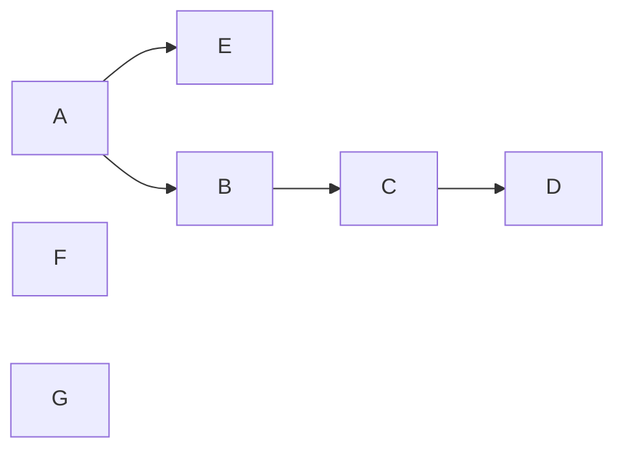

# HW3

PB18111697 王章瀚

-----

## 1.
**已知有关系模式 $R(A,B,C,D,E)$, $R$ 上的一个函数依赖集如下:**
$$F=\{A\rightarrow BC, B\rightarrow CE, A\rightarrow B, AB \rightarrow C, AC\rightarrow DE, E\rightarrow A\}$$

### (1).
**求出 $F$ 的最小函数依赖集 (要求写出求解过程)**

**将右边写出单属性并去除重复 FD**:
$F=\{A\rightarrow B, A\rightarrow C, B\rightarrow C, B \rightarrow E, AB\rightarrow C, AC\rightarrow D, AC \rightarrow E, E\rightarrow A\}$

**消除左部冗余属性**:

由 $A\rightarrow B$ 和 $B\rightarrow C$ 可推出 $A\rightarrow C$, 因此 $AB\rightarrow C$ 中的 $B$ 可以去掉, 去掉后变成了 $A\rightarrow C$:
$F=\{A\rightarrow B, A\rightarrow C, B\rightarrow C, B \rightarrow E, AC\rightarrow D, AC \rightarrow E, E\rightarrow A\}$

由 $A\rightarrow C$ 和 $A\rightarrow A$ 可知 $A\rightarrow AC$, 进而 $A\rightarrow D$, 因此 $AC \rightarrow D$ 左部的 $C$ 可去掉: 
$F=\{A\rightarrow B, A\rightarrow C, B\rightarrow C, B \rightarrow E, A\rightarrow D, AC \rightarrow E, E\rightarrow A\}$

同理, $AC\rightarrow E$ 左部的 C 也可以去掉: 
$F=\{A\rightarrow B, A\rightarrow C, B\rightarrow C, B \rightarrow E, A\rightarrow D, A \rightarrow E, E\rightarrow A\}$

**消除冗余函数依赖**

由 $A\rightarrow B$ 和 $B\rightarrow C$ 可推出 $A\rightarrow C$, 因此 $A\rightarrow C$ 可去掉: 
$F=\{A\rightarrow B, B\rightarrow C, B \rightarrow E, A\rightarrow D, A \rightarrow E, E\rightarrow A\}$

由 $A\rightarrow B$ 和 $B\rightarrow E$ 可推出 $A\rightarrow E$, 因此 $A\rightarrow E$ 可去掉: 
$F=\{A\rightarrow B, B\rightarrow C, B \rightarrow E, A\rightarrow D, E\rightarrow A\}$

### (2).

**求 R 的候选码, 并证明.**

候选码 $X$ 的必要条件是其为超码. 对于 $A, B, E$(由于它们循环互推), 它们均也能推出 $C$ 和 $D$. 故 $A, B, E$ 是超码. 但 $C$ 和 $D$ 只出现在了最小函数依赖集中依赖函数的右端, 意味着它们或它们的组合不可能推出 $A, B, E$, 即非超码. 而任何包含了 $A, B, E$ 的码都是超码. 

但由于 A, B, E 各自都可以推出 $\{A,B,C,D,E\}$ 的任意子集, 故候选码有 $A, B, E$

## 2.

**现有关系模式: $R(A,B,C,D,E,F,G)$, $R$ 上的一个函数依赖集:**
$$F=\{AB\rightarrow E,A\rightarrow B, B\rightarrow C,C\rightarrow D\}$$

该函数依赖集首先可以由 $A\rightarrow B$ 和 $A\rightarrow A$ 得到 $A\rightarrow AB$, 进而得到 $A\rightarrow E$, 进而将 $AB\rightarrow E$ 左部的 B 去掉, 得到：
$$F=\{A\rightarrow E,A\rightarrow B, B\rightarrow C,C\rightarrow D\}$$

因此也容易获知, 候选码是 A. 有依赖图如下:

### (1).

**该关系模式满足第几范式? 为什么?**

易知主属性集为 $\{A, F, G\}$, 非主属性集为 $\{B,C,D,E\}$
首先若其元组的每一个属性值都只含有一个值, 则至少**是 1NF**.
但对于非主属性 B,C,D,E, 均不是完全依赖于主码 $\{A,F,G\}$ (只是完全依赖于 A), 因此 **不是 2NF**

综上, 满足第一范式.

### (2).

**如果将关系模式 R 分解为: $R1(A,B,E)$, $R2(B,C,D)$, $R3(A,F,G)$, 该数据库模式最高满足第几范式?**

由于有传递依赖, 所以不是 3NF;
而 1NF 是关系的基本要求.
且每一个子关系模式中, 非主属性都完全依赖于主码. 即, 
- 对于 $R1$, 非主属性 $B$ 和 $E$ 完全依赖于主码 $A$; 
- 对于 $R2$, 非主属性 $C$ 和 $D$ 完全依赖于主码 $B$; 
- 对于 $R3$, $\{A,F,G\}$ 即是主码.
  
因此这满足 2NF.

因此最高满足第 2 范式

### (3).

**请将关系模式 $R$ 无损连接并且保持依赖地分解到 3NF, 要求给出具体步骤.**

1. 最小函数依赖集上已求出:
$$F=\{A\rightarrow E,A\rightarrow B, B\rightarrow C,C\rightarrow D\}$$

2. 不在 $F$ 中出现的属性集 $R'=\{F, G\}$

3. 按左部分组: $R1(ABE), R2(BC), R3(CD)$

4. 得到保持函数依赖的分解: $q=\{R1(ABE), R2(BC), R3(CD), R'(FG)\}$

5. R 的主码是 $\{A,F,G\}$, 并入 $q$, 并消去子集得到最终结果:
$$\{R1(ABE), R2(BC), R3(CD), R'(AFG)\}$$

### (4).

**请将关系模式 $R$ 无损连接地分解到 BCNF, 要求给出步骤.**

原本是 
$R=\{A,B,C,D,E,F,G\}$, 
$F=\{A\rightarrow E,A\rightarrow B, B\rightarrow C,C\rightarrow D\}$

其中主码为 $\{A,F,G\}$, $\rho:=\{R\}$

其中一个不满足 BCNF 的为 $B\rightarrow C$, 分解之得:
$$\rho:=\{R1(ABDEFG), R2(BC)\}$$

此时, $R1$ 和 $R2$ 均已满足 BCNF 定义.
