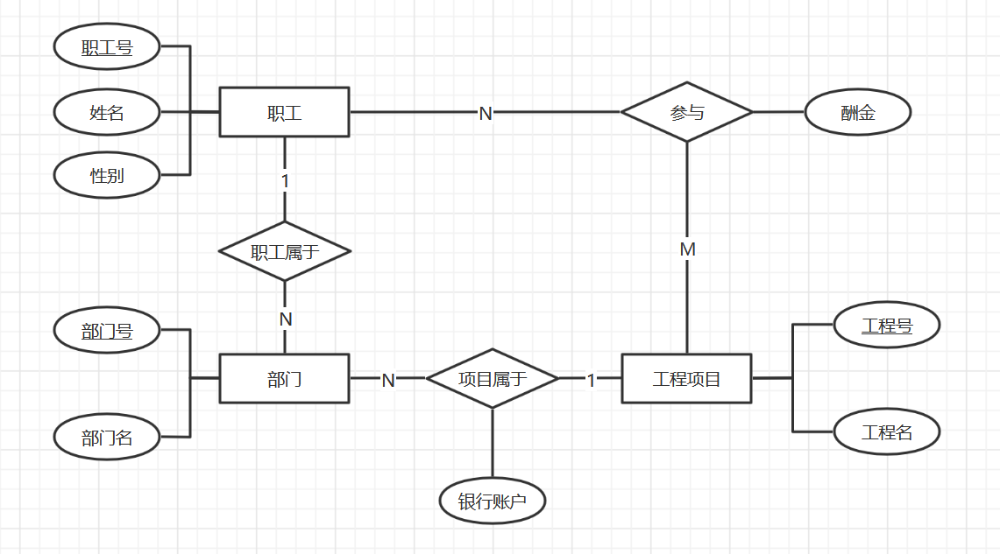
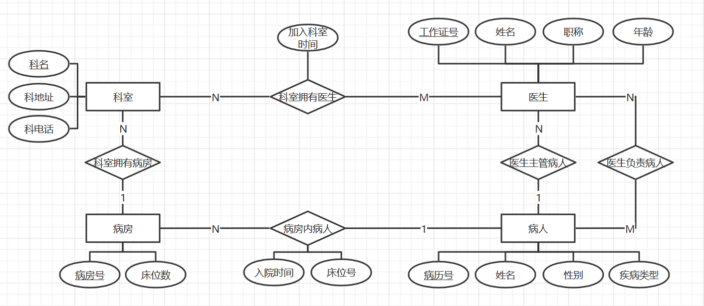

# HW4

PB18111697 王章瀚

-----

## 1

假设某公司要开发一个信息管理系统. 根据调研, 获得该公司的业务规则如下(所有实体的码可以按日常生活中的一般规则处理): 
1. 公司下设几个部门, 如技术部, 财务部, 市场部等；
2. 每个部门承担多个工程项目, 每个工程项目属于一个部门. 每个部门为其承担的每个项目分别开设独立的银行账户. 
3. 每个部门有多名职工, 每一名职工只能属于一个部门. 
4. 一个职工可能参与多个工程项目, 且每个工程项目有多名职工参与施工. 根据职工在工程项目中完成的情况发放酬金. 
5. 工程项目有工程号, 工程名两个属性；部门有部门号, 部门名称两个属性；职工有职工号, 姓名, 性别属性. 

根据以上描述, 请画出相应的ER模型(使用PPT上的传统ER图符号), 并将它转换为关系数据库模式. 注: 关系模式和属性名称均使用中文名称. 

### ER 模型

ER 模型如下图所示:
<table style='text-align: center;'>
    <tr>
        <td>
</img>第 1 题的 ER 模型
</td>
    </tr>
</table>

### 转化为关系数据库模式

首先转换实体得到:
1. **职工**(<u>职工号</u>, 姓名, 性别)
2. **部门**(<u>部门号</u>, 部门名)
3. **工程项目**(<u>工程号</u>, 工程名)

然后转换联系:
1. 职工:部门 (N:1): **职工**(<u>职工号</u>, 姓名, 性别, 部门号)
2. 工程项目:部门 (N:1): **工程项目**(<u>工程号</u>, 工程名, 部门号, 银行账户)
3. 职工:工程项目 (M:N): **参与**(<u>职工号</u>, <u>工程项目号</u>, 酬金)

得到初步关系数据库模式:
1. **职工**(<u>职工号</u>, 姓名, 性别, 部门号)
2. **部门**(<u>部门号</u>, 部门名)
3. **工程项目**(<u>工程号</u>, 工程名, 部门号, 银行账户)
4. **参与**(<u>职工号</u>, <u>工程项目号</u>, 酬金, 完成情况)

<!-- 经审查, 该模式满足 1NF; 且由于各个模式都满足非主属性完全依赖于主属性, 因此也是 2NF; 再者, 由以下依赖关系图可知, 每个模式的非主属性都不传递依赖于主码, 因此也是 3NF 的. 对于该场景, 更新和查询强度相当, 3NF 是比较合适的, 因此上述关系数据库模式是比较恰当的. -->

## 2

医院病房管理中心需要如下信息: 
1. 科室: 科名, 科地址, 科电话, 医生姓名
2. 病房: 病房号, 床位数, 当前病人数, 所属科室名
3. 医生: 姓名, 职称, 所属科室名, 加入科室时间, 年龄, 工作证号
4. 病人: 病历号, 姓名, 性别, 疾病类型, 主管医生, 病房号, 入院时间, 床位号

其中, 一个科室拥有多个病房和多名医生, 一个病房只能属于一个科室, 一个医生可以属于多个科室并且需要负责多个病人的诊治, 但一个病人的主管医生只有一个. 

根据以上描述, 请画出相应的ER模型(使用PPT上的传统ER图符号), 并将它转换为关系数据库模式. 注: 关系模式和属性名称均使用中文名称. 

### ER 模型

ER 模型如下图所示:
<table style='text-align: center;'>
    <tr>
        <td>
</img>第 2 题的 ER 模型
</td>
    </tr>
</table>

### 转化为关系数据库模式

首先转换实体得到:
1. **科室**(<u>科名</u>, 科地址, 科电话)
2. **病房**(<u>病房号</u>, 床位数, 病人数)
3. **病人**(<u>病历号</u>, 姓名, 性别, 疾病类型)
4. **医生**(<u>工作证号</u>, 姓名, 职称, 年龄)

然后转换联系:
1. 科室:医生 (M:N): **科室拥有医生**(<u>工作证号</u>, <u>科名</u>, 加入科室时间)
2. 医生主管病人, 医生:病人(1:N): **病人**(<u>病历号</u>, 姓名, 性别, 疾病类型, 医生_工作证号)
3. 医生负责病人, 医生:病人(M:N): **医生负责病人**(<u>医生_工作证号</u>, <u>病人_病历号</u>)
4. 病房内病人, 病房:病人(1:N): **病人**(<u>病历号</u>, 姓名, 性别, 疾病类型, 医生_工作证号, 病房_病房号, 入院时间, 床位号)
5. 科室拥有病房, 科室:病房(1:N): **病房**(<u>病房号</u>, 床位数, 病人数, 科室号)

得到初步关系数据库模式:
1. **科室**(<u>科名</u>, 科地址, 科电话)
2. **病房**(<u>病房号</u>, 床位数, 病人数, 科室号)
3. **病人**(<u>病历号</u>, 姓名, 性别, 疾病类型, 医生_工作证号, 病房_病房号, 入院时间, 床位号)
4. **医生**(<u>工作证号</u>, 姓名, 职称, 年龄)
5. **科室拥有医生**(<u>工作证号</u>, <u>科名</u>, 加入科室时间)
6. **医生负责病人**(<u>医生_工作证号</u>, <u>病人_病历号</u>)

<!-- 经审查, 该模式满足 1NF; 且由于各个模式都满足非主属性完全依赖于主属性, 因此也是 2NF; 再者, 由以下依赖关系图可知, 每个模式的非主属性都不传递依赖于主码, 因此也是 3NF 的. 对于该场景, 更新和查询强度相当, 3NF 是比较合适的, 因此上述关系数据库模式是比较恰当的. -->