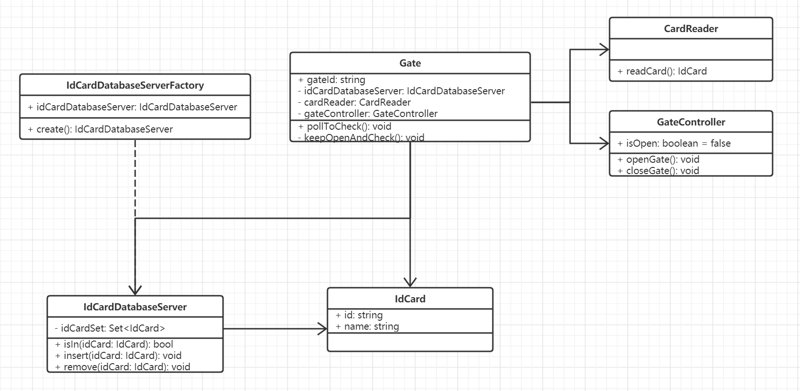
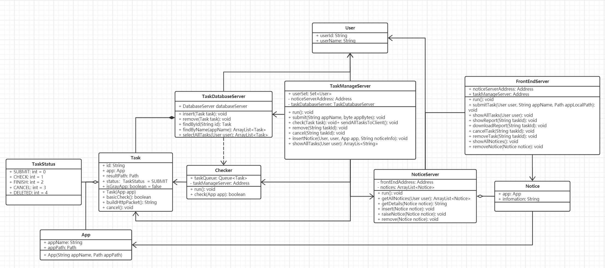
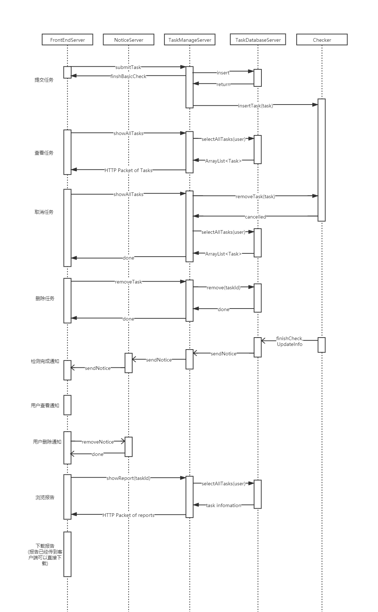

# 软件工程导论 HW3

PB18111697 王章瀚

-----

## 1.

**请仔细观察学校校门进出口闸机的工作方式, 设计相关的类, 画出相应的类图.**

### 类设计

设计类如下:

```cpp
// 校园卡数据库服务器
class IdCardDatabaseServer {
public:
    IdCardDatabaseServer(); // 构造函数
    bool isIn(IdCard idCard); // 检查校园卡是否合法
    void insert(IdCard idCard); // 插入校园卡信息
    void remove(IdCard idCard); // 删除校园卡信息
private:
    Set<IdCard> idCardSet;
};

// 校园卡数据库服务器工厂, 希望设计成`单例模式`.
class IdCardDatabaseServerFactory {
public:
    IdCardDatabaseServer idCardDatabaseServer; // 校园卡单例
    IdCardDatabaseServer create(); // 创建校园卡数据库服务器
};

// 校园卡类
class IdCard {
public:
    string id;
    string name;
}

// 读卡器
class CardReader {
public:
    IdCard readCard(); // 检测并读取当前卡信息
};

class GateController {
public:
    bool isOpen; // 闸机是否开启
    void openGate(); // 开启闸机
    void closeGate(); // 关闭闸机
};

// 闸机类
class Gate {
public:
    int gateId; // 闸机的 id 标识
    /* 轮询检查 id 卡, 
     * 这里会调用 `cardReader.readCard()` 来读取卡信息
     * 而后调用 `idCardDatabaseServer.isIn(...)` 检查卡合法性
     * 然后调用 `gateController` 执行相关操作
     * 并陷入 `keepOpenAndCheck` 以等待一定时间
     */
    void pollToCheck(); 
private:
    IdCardDatabaseServer idCardDatabaseServer;
    CardReader cardReader;
    GateController gateController;
    /*
     * 等待一定时间以使当前用户通过
     */
    void keepOpenAndCheck();
};
```

### 类图

所有操作流程都在上面的注释描述清楚了, 依据这样的类设计给出类图如下:
<table style="text-align: center;">
    <tr>
        <td><p></img>第 1 题的类图设计</p></td>
    </tr>
</table>


## 2.
请绘制安卓灰色应用检测系统的任务管理模块类图. 
安卓灰色应用检测系统中任务管理模块的主要功能是创建检测任务、查看检测任务、取消检测任务、删除检测记录、报告管理和通知管理. **将该模块分为三部分**：

- **第一部分：检测任务管理**
  1). 创建检测任务
  用户要创建一个检测任务时, 需要从本地上传应用APK文件, 检测平台会对上传的文件格式做一个初始校验, 如果文件格式错误, 检测平台会进行提示并让用户重新上传, 如果格式正确, 则任务创建成功. 
  2). 查看检测任务
  用户可以查看检测任务, 服务端会在数据库查询相关信息, 按照约定好的http报文格式将应用数据组装好传输给客户端. 
  3). 取消检测任务 
  对于一个正在进行中的任务, 用户可以在任务列表中取消任务, 服务端会把该应用的相关信息 从数据库中删除并在服务器硬盘上删除和该应用相关的所有文件. 
  4). 删除检测记录 
  用户可以选择一个已经结束的检测任务, 向检测平台提交删除检测记录的请求, 服务端会删除和应用相关的所有文件和数据. 
- **第二部分：报告管理**
  动态检测引擎检测出灰色应用后, 用户可以进行浏览报告或下载报告的操作, 服务端会在数据库查询相关信息返回客户端. 
- **第三部分：通知管理**
  通知管理模块负责将检测任务结束通知和灰色应用检测通知推送给Web客户端. 用户可进行阅读通知、删除通知的操作. 

**请设计相关的类, 完成该模块这三部分的类图.**
(附加：尝试画出检测平台的总体工作流程时序图, 会有加分, 但不作强制要求)

### 相关类设计

```java
// 任务状态枚举类
enum TaskStatus {
    SUBMIT,
    CHECK,
    FINISH,
    CANCEL,
    DELETED
}

// 应用类
public class App {
    public String appName; // 应用名
    public Path appPath; // 应用存放路径

    public App(String appName, Path appPath);
}

// 任务类
class Task {
    public String id; // 任务 id
    public App app;
    public Path resultPath; // 检测结果数据存放路径
    public TaskStatus status = SUBMIT; // 任务状态
    public boolean isGrayApp = false; // 是否为灰色应用

    // 任务的构造函数
    public Task(App app);
    // 任务初始校验
    private boolean basicCheck();
    // 依据已有信息构建 http 报文
    public String buildHttpPacket();
    /* 取消任务
     * 将设置 status = CANCEL;
     */
    public void cancel();
}


class TaskDatabaseServer {
    public DatabaseServer databaseServer;
    // 向数据库插入任务
    public void insert(Task task);
    // 从数据库移除任务
    public void remove(Task task);
    // 从数据库查找任务
    public Task findById(String id);
    public ArrayList<Task> findByName(appName);
    public ArrayList<Task> selectAllTasks(User user);
}

// 检测引擎
class Checker extends Thread {
    private Address taskManageServer; // 用以向任务管理服务器通信
    public Queue<Task> taskQueue;
    // Checker 主线程
    public void run();
    public boolean check(App app);
    public insertTask(Task);
    public removeTask(Task);
}

class User {
    public String userId;
    public String userName;
}

// 任务管理服务器
class TaskManageServer extends Thread {
    public Set<User> userSet;
    private Address noticeServerAddress; // 用以向通知服务器通信
    private TaskDatabaseServer taskDatabaseServer; // 用以直接调用任务数据库服务器
    
    // 服务器主线程
    public void run();
    /* 提交任务
     * 任务提交后, `task` 会调用其私有成员函数 `basicCheck` 检查文件格式
     * 注意这里接收的是用户封装而发过来的应用 byte 流
     */
    public void submit(User user, String appName, byte appBytes);
    // 做任务检测
    public void check(Task task);
    /* 查看任务
     * 借助下面的 `listTask()` 完成
     */
    public void sendAllTasksToClient();
    // 删除任务
    public void remove(String taskId);
    /* 取消任务
     * 将会同时也调用到删除任务
     */
    public void cancel(String taskId);
    // 发起通知
    public void insertNotice(User user, App app, String noticeInfo);
    /* 查看任务
     * 通过调用 `taskDatabaseServer.selectAllTasks()` 列出所有任务
     * 然后逐一调用 `buildHttpPacket` 来生成 http 报文, 以便发给客户端
     */
    private ArrayList<String> showAllTasks(User user);
}

// 通知类
class Notice {
    public App app;
    public String infomation;
}

// 通知服务器
class NoticeServer extends Thread{
    private Address frontEndAddress; // 用以向前端消息通信
    private HashMap<User, ArrayList<Notice>> notices;

    // 服务器主线程
    public void run();
    public ArrayList<Notice> getAllNotices(User user);
    public String getDetails(Notice notice);
    public void insert(Notice notice);
    // 向 web 端发起通知
    public void raiseNotice(Notice notice);
    public void remove(Notice notice);
}

// 前端应有相关的交互界面等
class FrontEndServer extends Thread {
    private Address noticeServerAddress; // 用以向通知服务器通信
    private Address taskManageServer; // 用以向任务管理服务器通信
    
    // 服务器主线程
    public void run();
    // 提交任务
    public void submitTask(User user, String appName, Path appLocalPath);
    // 列出所有任务
    public void showAllTasks(User user);
    // 显示报告
    public void showReport(String taskId);
    // 下载报告
    public void downloadReport(String taskId);
    // 取消任务
    public void cancelTask(String taskId);
    // 删除任务
    public void removeTask(String taskId);
    // 显示通知, 向 `noticeServer` 请求数据
    public void showAllNotices();
    // 显示通知详情
    public void showNoticeDetails(Notice notice);
    // 删除通知
    public void removeNotice(Notice notice);
}
```

### 类图

根据以上设计可以画出类图如下:
<table style="text-align: center;">
    <tr>
        <td><p></img>第 2 题的类图设计</p></td>
    </tr>
</table>

### 总体工作流程时序图
如下:
<table style="text-align: center;">
    <tr>
        <td><p></img>第 2 题的时序图</p></td>
    </tr>
</table>


