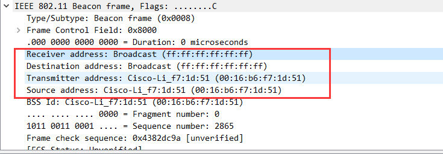
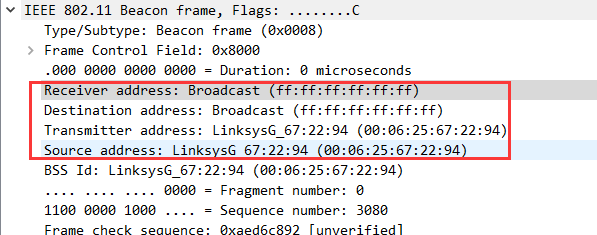
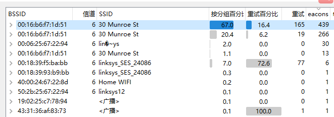
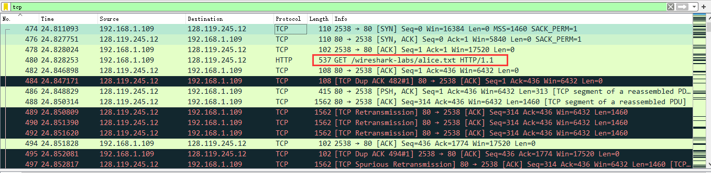
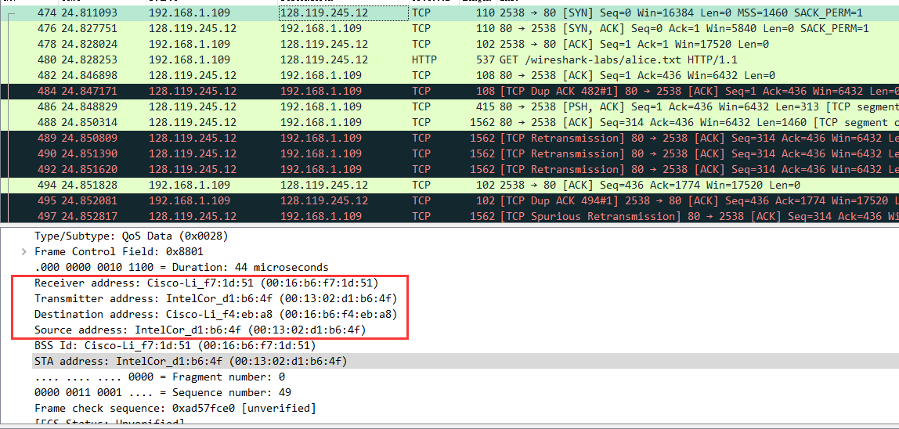
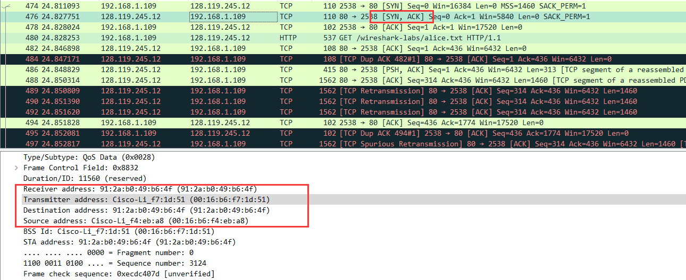
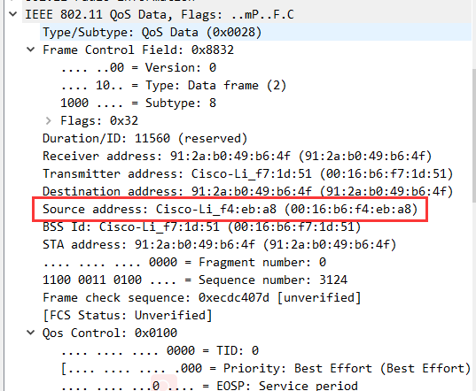
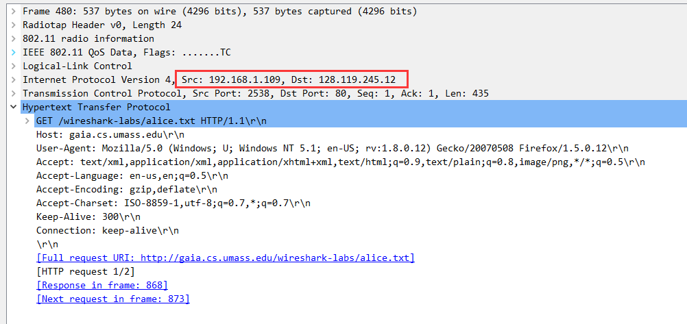
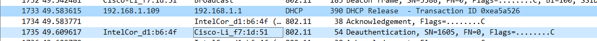

# 计网实验3: 802.11

PB18111697 王章瀚

---

## 问题与回答

### 1.
> What are the SSIDs of the two APs that are issuing most of the beacon frames in this trace? 

主要是 `30 Munroe St(00:16:b6:f7:1d:51)` 和 `lin�~ys(00:06:25:67:22:94)`
这可以由 wireshark 的按 beacons 排序功能找出:

### 2.
> What are the three addresses in the Beacon frame from the two APs respectively.

可以列表如下:
||30 Munroe St (00:16:b6:f7:1d:51)|linksys_SES_24086 (00:06:25:67:22:94)|
|:-|:-|:-|
|Receiver Address|ff:ff:ff:ff:ff:ff|ff:ff:ff:ff:ff:ff|
|Destination Address|ff:ff:ff:ff:ff:ff|ff:ff:ff:ff:ff:ff|
|Transmitter/source Address|00:16:b6:f7:1d:51|00:06:25:67:22:94|
相应截图:
`30 Munroe St(00:16:b6:f7:1d:51)` 的对应下图:

`linksys_SES_24086(00:06:25:67:22:94)` 的对应下图:

### 3.
> How many APs the wireless laptop has received Beacon frames from? List their MAC addresses. Why the laptop can receive frames from an AP even though it does not associate with the AP?

如下图所示, 根据下表可以看出来, 

主要的 AP 共有 8 个, 如下所示:
|SSID|MAC|
|:-|:-|
|`30 Munroe St`|00:16:b6:f7:1d:51|
|`lin�~ys`|00:06:25:67:22:94|
|`linksys_SES_24086`|00:18:39:f5:ba:bb|
|`linksys_SES_24086`|00:18:39:f5:b9:bb|
|`Home WIFI`|40:00:24:67:22:8d|
|`linksys12`|00:16:b6:f7:1d:51|
|`<广播>`|19:02:25:c7:78:94|
|`<广播>`|43:31:36:af:83:73|

之所以可以收到来自没连接上的 AP 的 frames, 主要有主动和被动两种原因.
- 被动方面: 是因为 "802.11 标准要求每个 AP 周期性地发送信标帧(beacon frame)".
- 主动方面: 无线主机也可以执行主动扫描, 通过向位于无线主机范围内的所有 AP 广播探测帧完成.

### 4.
> Find the 802.11 frame containing the SYN TCP segment for this first TCP session (that downloads alice.txt). What are the three MAC addresses in the frame, which is the address for wireless laptop / AP / first-hop router? 

如下图所示即为一个 GET 的 http 请求来请求 `alice.txt` 文件.

对应的第一个 TCP session 的 SYN TCP segment 应该是 No.474 这一个报文. 如下图所示:

因此我们可以知道, 三个对应的 MAC address 为 
Receiver address -- 00:16:b6:f7:1d:51 -- AP
Source address -- 00:13:02:d1:b6:4f -- wireless laptop
Destination address -- 00:16:b6:f4:eb:a8 -- first-hop rounter

### 5.
> For the SYN-ACK segment of the first TCP session, what are the three MAC addresses in the frame, and which is the address for wireless laptop / AP / first-hop router? 

如下图所示, 第 476 号 segment 即所要查找的.

其中有:
Receiver/Destination address -- 91:2a:b0:49:b6:4f -- wireless laptop
Transmitter address -- 00:16:b6:f7:1d:51 -- AP
Source address -- 00:16:b6:f4:eb:a8 -- first-hop router

### 6.
> For the above mentioned SYN-ACK segment, is the sender MAC address corresponds to the web server’s IP address? Why?

sender 的 MAC 可从下图得知为 `00:16:b6:f4:eb:a8`

web server 的 IP 从下图得知为 `128.119.245.12`

这显然不是相对应的. 因为服务器和 sender 不在同一个子网内部, 所以 sender 的 MAC 地址取决于它子网的情况, 如下一跳路由器的 MAC 地址. 当跨越子网的时候, 对应 MAC 地址会发生改变.

### 7.
> What two actions are taken (i.e., frames are sent) by the host in the trace just after t=49, to end the association with the 30 Munroe St AP?

观察到下图两个蓝色的 frames. 第一个是向 DHCP 服务器发送 release 以释放占用. 第二个是向主机发送了 Deauthentication.

### 8.
> Can you capture a similar trace? Why or why not?

可以. 我们只需要在在相应的时刻, 按上面的操作步骤向相同的 AP 和 WebServer 发送相同的请求就可以完成.

但我们也需要相应的设备:
> Here, since 802.11 is a wireless link-layer protocol, we’ll be capturing frames “in the air.” Unfortunately, many device drivers for wireless 802.11 NICs don’t provide the hooks to capture/copy received 802.11 frames for use in Wireshark